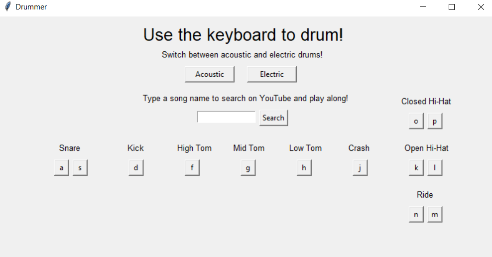

# Drum Kit GUI
A basic keyboard-controlled drum kit made with Tkinter and pyglet.

# How It Works
The program binds keyboard keys to different drum sound effects. The GUI includes buttons to manually play these sound effects, as well as two buttons to switch between
acoustic or electric mode. Additionally, a text box allows the user to type in the name of a song, which will then open a new tab showing the YouTube search results for that
song.

# What It Looks Like

